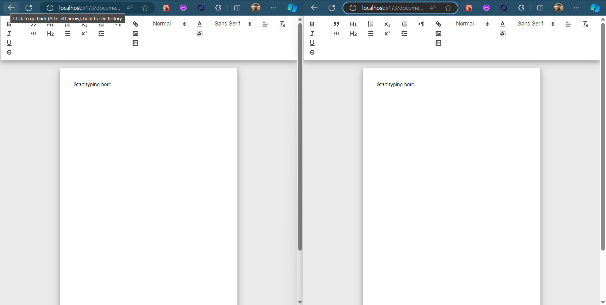
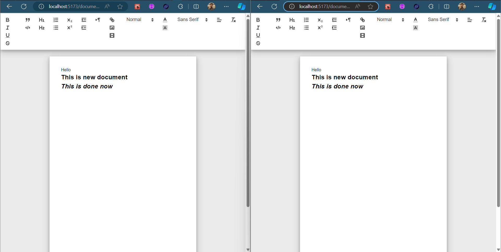

# Realtime Editable Document

This web-application made as a mini clone of Google-Doc with the realtime documentation updation and store the data in database field


## Tech Stacks

<a href="" target="_blank" rel="noreferrer">  </a>
<a href="" target="_blank" rel="noreferrer">  </a>
<a href="" target="_blank" rel="noreferrer">  </a>
<a href="" target="_blank" rel="noreferrer">  </a>
<a href="" target="_blank" rel="noreferrer">  </a>
<a href="" target="_blank" rel="noreferrer">  </a>

# Doc working demo video

https://github.com/arghyadutta080/Realtime-Editable-Doc/assets/102239340/3488cd79-78c8-4061-892c-679c34b19d4d


## UI of the Web-App

<p align='center'>


<p>


## Getting Started

To run this project locally, follow these steps:

1. **Clone the repository:**

    ```bash
    git clone https://github.com/arghyadutta080/Realtime-Editable-Doc.git
    cd web sockets
    ```
2. **Open the `web sockets` directory in your Code-Editor (In my case it's VS-Code)**

3. **Open the terminal in your Code-Editor and split it into two terminals**
   
3. **In the first terminal move to the server directory:**
   
    ```bash
    cd server
    ```
    
4. **Install dependencies:**
   
    ```bash
    npm install
    ```
    
5. **Create a `.env` file at the root of the `server` directory with the following content:**
   
    ```env
    MONGODB_URL=<your-mongodb-uri>
    ```

6. **Run the `server`:**

    ```bash
    npm run start
    ```

5. **In the second terminal move to the `client` directory:**

    ```bash
    cd client
    ```

5. **Install dependencies:**

    ```bash
    npm install
    ```

5. **Run the `client`:**

    ```bash
    npm run dev
    ```

6. **Now, You will be redirected to [localhost:5173](http://localhost:5173)**


## Contributing

Contributions to the project are welcome! To contribute, fork the repository and create a new branch for your changes. Once you have made your changes, create a pull request to merge your branch into the main repository.

